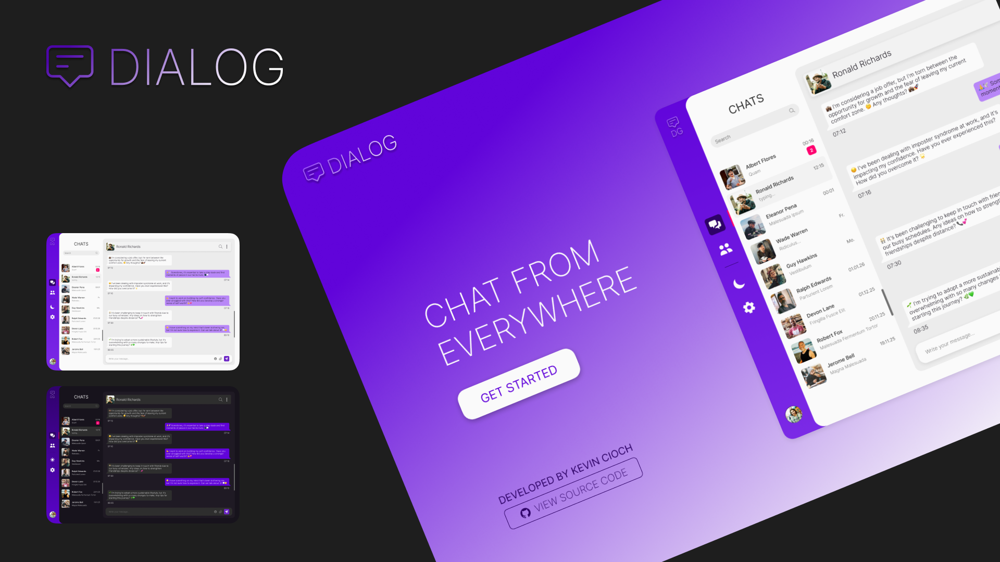
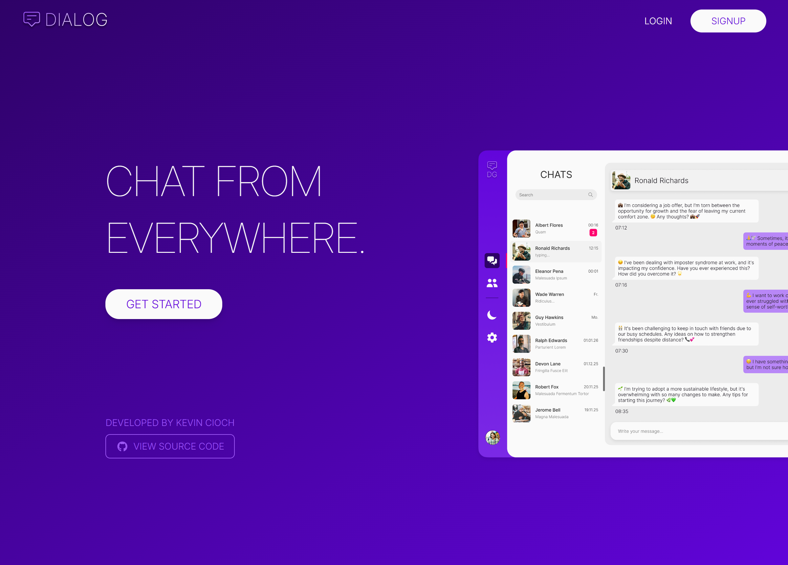
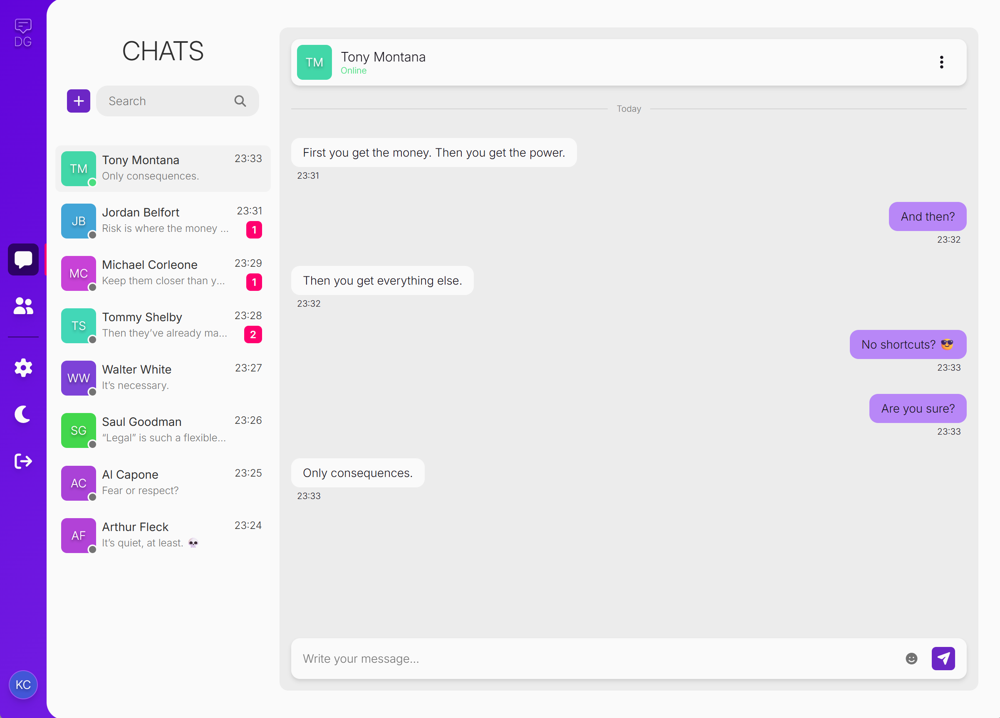
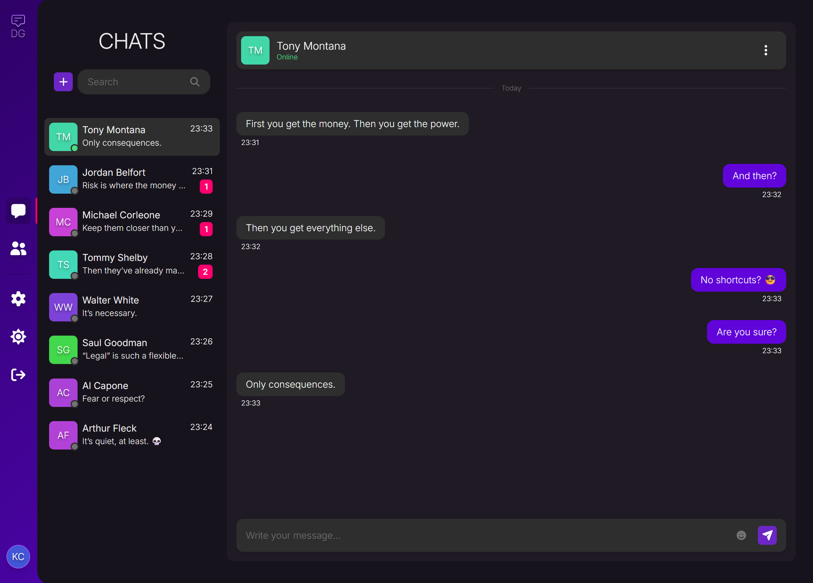
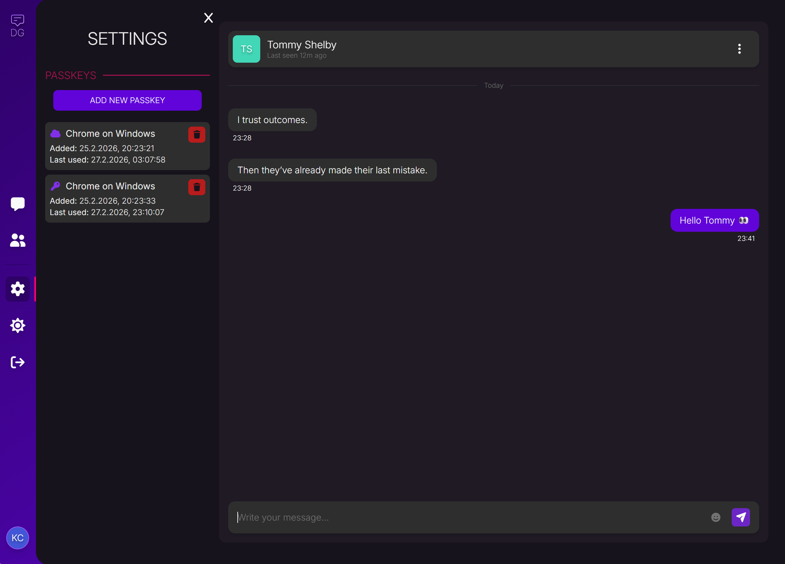
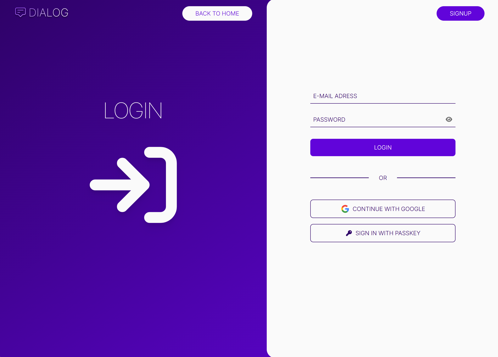
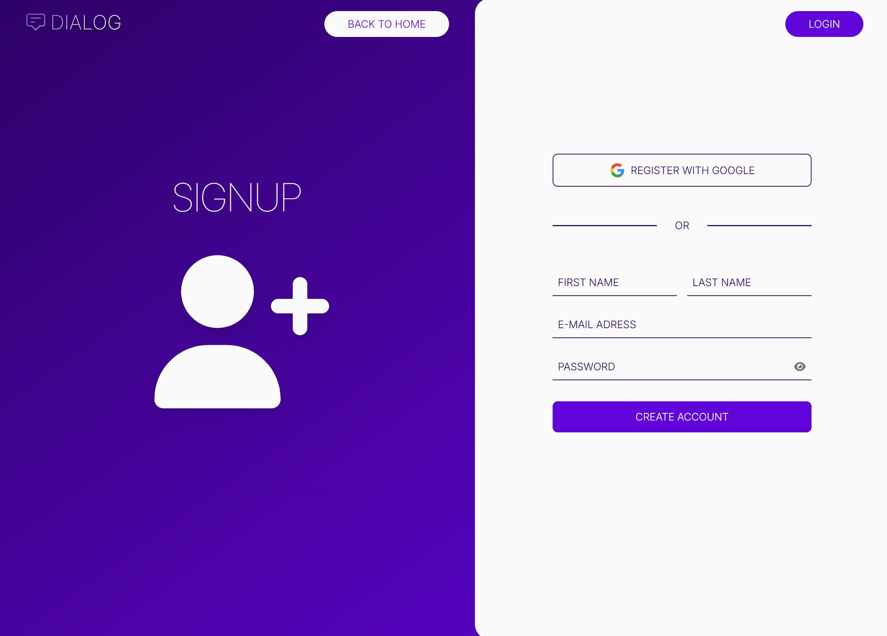

<h1 align="center">
  DIALOG 💬
  <p style="font-style: italic ">CHAT FROM EVERYWHERE.</p>
</h1>

<p align="center">
  
</p>

`DIALOG` is a modern, full-stack chat web application built with React, TypeScript, Express, and PostgreSQL. It delivers seamless real-time messaging and live notifications powered by Socket.io, ensuring instant, event-driven communication across clients.

Authentication is implemented with a strong focus on both security and user experience. The application supports traditional email/password login, Google OAuth integration, and passwordless authentication via passkeys (WebAuthn). This multi-strategy approach demonstrates secure session handling, modern identity flows, and industry-aligned best practices.

The backend exposes a structured REST API and leverages Prisma ORM for type-safe, maintainable database access.

Designed not just as a demo, but as a practical showcase of modern web application architecture.

# Live Demo

You can see the application in action by checking out the [live demo](https://dialog.kevincioch.com).

# Screenshots

<div align="center" style="display: flex; justify-content: center; flex-wrap: wrap; gap: 2em">
  
  
  
  
  
  
</div >

# Features

## Chat

- Real-time messaging (WebSockets)
- Private conversations
- Unread indicators & notifications
- Darkmode / Lightmode

## Authentication

- Email & password login
- Google OAuth
- Passkeys (WebAuthn)
- JWT-based sessions

## Backend

- REST API (Express)
- PostgreSQL database
- Secure authentication & validation

# Requirements

- Node.js (v18+)
- PostgreSQL
- Google OAuth credentials
- npm or yarn

# Setup

Follow these steps to run the project locally.  
Make sure to create a `.env` file in both `frontend` and `backend` based on their respective `.env.sample` files.

```bash
# 1. Clone repository
git clone https://github.com/kecioch/dialog

# 2. Navigate into project
cd dialog

# 3. Install backend dependencies
cd backend
npm install

# 4. Configure backend environment variables
# Rename .env.sample to .env and fill in required values

# 5. Start backend (dev mode)
npm run dev
```

Open a second terminal:

```bash
# 6. Navigate to frontend
cd frontend

# 7. Install frontend dependencies
npm install

# 8. Configure frontend environment variables
# Rename .env.sample to .env and fill in required values

# 9. Start frontend
npm run start
```

# Technologies

- [React](https://reactjs.org/)
- [Tailwind](https://tailwindcss.com/)
- [Express.js](https://expressjs.com/)
- [Socket.IO](https://socket.io/)
- [JWT](https://www.jwt.io/)
- [Google OAuth 2.0](https://developers.google.com/identity/protocols/oauth2)
- [WebAuthn (Passkeys)](https://en.wikipedia.org/wiki/WebAuthn)

# Credits & Licenses

- **SoundEffect Message Sent** — Froey\_  
  https://freesound.org/s/760370/  
  License: Creative Commons 0 (CC0)

- **SoundEffect MessageAlert01** — aj_heels  
  https://freesound.org/s/634079/  
  License: Creative Commons Attribution 4.0 (CC BY 4.0)

<!--
> <b>CARD-NR.:</b> 4242 4242 4242 4242
> <br /><b>EXPIRY DATE:</b> use a future date
> <br /><b>CHECK DIGIT:</b> 424 -->
